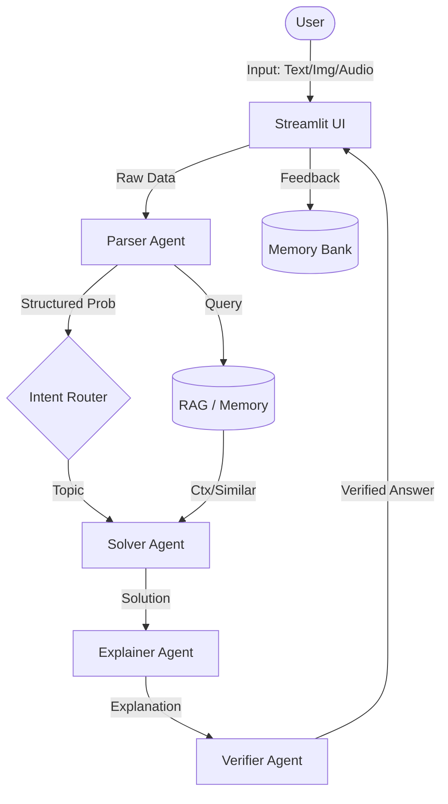

# 📘 AI Math Mentor

**Multimodal | RAG-Enhanced | Agentic Workflow | HITL**

AI Math Mentor is an advanced educational tool designed to help students solve JEE-level math problems. It leverages the power of Large Language Models (LLMs), Retrieval-Augmented Generation (RAG), and a multi-agent system to provide accurate solutions and clear explanations.

## 🚀 Key Features

-   **Multimodal Input**: Accepts text, images (OCR), and audio (ASR) as input methods.
-   **Agentic Workflow**:
    -   **Parser Agent**: Analyzes the problem and structures the request.
    -   **Intent Router**: Classifies the problem topic (e.g., Algebra, Calculus).
    -   **Solver Agent**: Solves the problem using RAG context and step-by-step logic.
    -   **Explainer Agent**: Acts as a tutor, explaining the solution in natural language.
    -   **Verifier Agent**: Checks the solution for consistency.
-   **RAG (Retrieval-Augmented Generation)**: Retrieves relevant math formulas and similar solved problems from a local knowledge base to improve accuracy.
-   **Memory Bank**: Learns from user-verified solutions, storing them for future retrieval.
-   **Human-In-The-Loop (HITL)**: Flags low-confidence solutions for user review and allows users to provide feedback (Correct/Incorrect) to improve the system.

## 🛠️ Architecture

The application is built using:
-   **Streamlit**: For the interactive web interface.
-   **LangChain**: For orchestrating the LLM agents and RAG pipeline.
-   **Ollama**: For running the local LLM (Llama 3).
-   **ChromaDB**: As the vector store for RAG.
-   **EasyOCR** & **Whisper**: For image and audio processing.


## 📋 Prerequisites

-   **Python 3.10+**
-   **Ollama**: Installed and running locally.
    -   Pull the model: `ollama pull llama3`

## 📦 Installation

1.  **Clone the repository**
    ```bash
    git clone <repository-url>
    cd math_mentor_ai
    ```

2.  **Create a virtual environment**
    ```bash
    python -m venv venv
    # Windows
    .\venv\Scripts\activate
    # macOS/Linux
    source venv/bin/activate
    ```

3.  **Install dependencies**
    ```bash
    pip install -r requirements.txt
    ```

## ⚙️ Configuration

1.  Create a `.env` file in the root directory (copy from `.env.example`):
    ```bash
    cp .env.example .env
    ```

2.  Update the `.env` file if needed (defaults are usually fine for local Ollama):
    ```ini
    LLM_PROVIDER=ollama
    LLM_MODEL=llama3
    ```

## ▶️ Usage

1.  **Ensure Ollama is running**:
    ```bash
    ollama serve
    ```

2.  **Run the Streamlit app**:
    ```bash
    streamlit run app.py
    ```

3.  **Use the App**:
    -   Select input mode (Text, Image, or Audio).
    -   Input your math problem.
    -   Review parsed output and RAG results.
    -   Click "Solve Problem" to get the solution.
    -   Verify the solution and provide feedback to update the Memory Bank.
### 🔄 Data Flow



## 📂 Project Structure

```
math_mentor_ai/
├── agents/             # Agent definitions (Parser, Solver, Explainer, etc.)
├── hitl/               # Human-In-The-Loop logic
├── memory/             # Memory storage and similarity search
├── multimodal/         # OCR and ASR modules
├── rag/                # Retrieval system (Vector DB)
├── utils/              # Helper functions
├── app.py              # Main Streamlit application entry point
├── requirements.txt    # Python dependencies
└── .env                # Configuration variables
```

---

# 📘 AI Math Mentor

**Multimodal | RAG-Enhanced | Agentic Workflow | HITL**

AI Math Mentor is an advanced educational tool designed to help students solve JEE-level math problems. It leverages the power of Large Language Models (LLMs), Retrieval-Augmented Generation (RAG), and a multi-agent system to provide accurate solutions and clear explanations.

## 🚀 Key Features

-   **Multimodal Input**: Accepts text, images (OCR), and audio (ASR) as input methods.
-   **Agentic Workflow**:
    -   **Parser Agent**: Analyzes the problem and structures the request.
    -   **Intent Router**: Classifies the problem topic (e.g., Algebra, Calculus).
    -   **Solver Agent**: Solves the problem using RAG context and step-by-step logic.
    -   **Explainer Agent**: Acts as a tutor, explaining the solution in natural language.
    -   **Verifier Agent**: Checks the solution for consistency.
-   **RAG (Retrieval-Augmented Generation)**: Retrieves relevant math formulas and similar solved problems from a local knowledge base to improve accuracy.
-   **Memory Bank**: Learns from user-verified solutions, storing them for future retrieval.
-   **Human-In-The-Loop (HITL)**: Flags low-confidence solutions for user review and allows users to provide feedback (Correct/Incorrect) to improve the system.

## 🛠️ Architecture

The application is built using:
-   **Streamlit**: For the interactive web interface.
-   **LangChain**: For orchestrating the LLM agents and RAG pipeline.
-   **Ollama**: For running the local LLM (Llama 3).
-   **ChromaDB**: As the vector store for RAG.
-   **EasyOCR** & **Whisper**: For image and audio processing.


## 📋 Prerequisites

-   **Python 3.10+**
-   **Ollama**: Installed and running locally.
    -   Pull the model: `ollama pull llama3`

## 📦 Installation

1.  **Clone the repository**
    ```bash
    git clone <repository-url>
    cd math_mentor_ai
    ```

2.  **Create a virtual environment**
    ```bash
    python -m venv venv
    # Windows
    .\venv\Scripts\activate
    # macOS/Linux
    source venv/bin/activate
    ```

3.  **Install dependencies**
    ```bash
    pip install -r requirements.txt
    ```

## ⚙️ Configuration

1.  Create a `.env` file in the root directory (copy from `.env.example`):
    ```bash
    cp .env.example .env
    ```

2.  Update the `.env` file if needed (defaults are usually fine for local Ollama):
    ```ini
    LLM_PROVIDER=ollama
    LLM_MODEL=llama3
    ```

## ▶️ Usage

1.  **Ensure Ollama is running**:
    ```bash
    ollama serve
    ```

2.  **Run the Streamlit app**:
    ```bash
    streamlit run app.py
    ```

3.  **Use the App**:
    -   Select input mode (Text, Image, or Audio).
    -   Input your math problem.
    -   Review parsed output and RAG results.
    -   Click "Solve Problem" to get the solution.
    -   Verify the solution and provide feedback to update the Memory Bank.
### 🔄 Data Flow


## 📂 Project Structure

```
math_mentor_ai/
├── agents/             # Agent definitions (Parser, Solver, Explainer, etc.)
├── hitl/               # Human-In-The-Loop logic
├── memory/             # Memory storage and similarity search
├── multimodal/         # OCR and ASR modules
├── rag/                # Retrieval system (Vector DB)
├── utils/              # Helper functions
├── app.py              # Main Streamlit application entry point
├── requirements.txt    # Python dependencies
└── .env                # Configuration variables
```

---

# 📘 AI Math Mentor

**Multimodal | RAG-Enhanced | Agentic Workflow | HITL**

AI Math Mentor is an advanced educational tool designed to help students solve JEE-level math problems. It leverages the power of Large Language Models (LLMs), Retrieval-Augmented Generation (RAG), and a multi-agent system to provide accurate solutions and clear explanations.

## 🚀 Key Features

-   **Multimodal Input**: Accepts text, images (OCR), and audio (ASR) as input methods.
-   **Agentic Workflow**:
    -   **Parser Agent**: Analyzes the problem and structures the request.
    -   **Intent Router**: Classifies the problem topic (e.g., Algebra, Calculus).
    -   **Solver Agent**: Solves the problem using RAG context and step-by-step logic.
    -   **Explainer Agent**: Acts as a tutor, explaining the solution in natural language.
    -   **Verifier Agent**: Checks the solution for consistency.
-   **RAG (Retrieval-Augmented Generation)**: Retrieves relevant math formulas and similar solved problems from a local knowledge base to improve accuracy.
-   **Memory Bank**: Learns from user-verified solutions, storing them for future retrieval.
-   **Human-In-The-Loop (HITL)**: Flags low-confidence solutions for user review and allows users to provide feedback (Correct/Incorrect) to improve the system.

## 🛠️ Architecture

The application is built using:
-   **Streamlit**: For the interactive web interface.
-   **LangChain**: For orchestrating the LLM agents and RAG pipeline.
-   **Ollama**: For running the local LLM (Llama 3).
-   **ChromaDB**: As the vector store for RAG.
-   **EasyOCR** & **Whisper**: For image and audio processing.


## 📋 Prerequisites

-   **Python 3.10+**
-   **Ollama**: Installed and running locally.
    -   Pull the model: `ollama pull llama3`

## 📦 Installation

1.  **Clone the repository**
    ```bash
    git clone <repository-url>
    cd math_mentor_ai
    ```

2.  **Create a virtual environment**
    ```bash
    python -m venv venv
    # Windows
    .\venv\Scripts\activate
    # macOS/Linux
    source venv/bin/activate
    ```

3.  **Install dependencies**
    ```bash
    pip install -r requirements.txt
    ```

## ⚙️ Configuration

1.  Create a `.env` file in the root directory (copy from `.env.example`):
    ```bash
    cp .env.example .env
    ```

2.  Update the `.env` file if needed (defaults are usually fine for local Ollama):
    ```ini
    LLM_PROVIDER=ollama
    LLM_MODEL=llama3
    ```

## ▶️ Usage

1.  **Ensure Ollama is running**:
    ```bash
    ollama serve
    ```

2.  **Run the Streamlit app**:
    ```bash
    streamlit run app.py
    ```

3.  **Use the App**:
    -   Select input mode (Text, Image, or Audio).
    -   Input your math problem.
    -   Review parsed output and RAG results.
    -   Click "Solve Problem" to get the solution.
    -   Verify the solution and provide feedback to update the Memory Bank.
### 🔄 Data Flow


## 📂 Project Structure

```
math_mentor_ai/
├── agents/             # Agent definitions (Parser, Solver, Explainer, etc.)
├── hitl/               # Human-In-The-Loop logic
├── memory/             # Memory storage and similarity search
├── multimodal/         # OCR and ASR modules
├── rag/                # Retrieval system (Vector DB)
├── utils/              # Helper functions
├── app.py              # Main Streamlit application entry point
├── requirements.txt    # Python dependencies
└── .env                # Configuration variables
```

---

